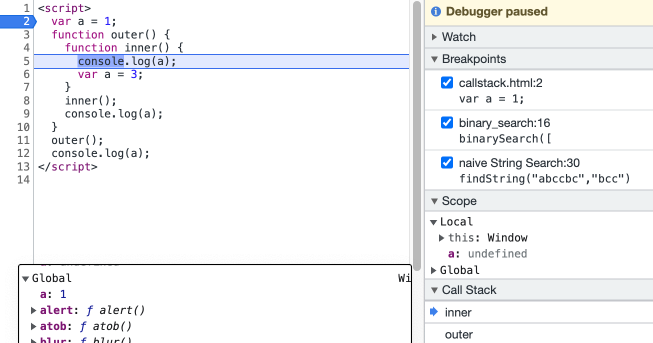
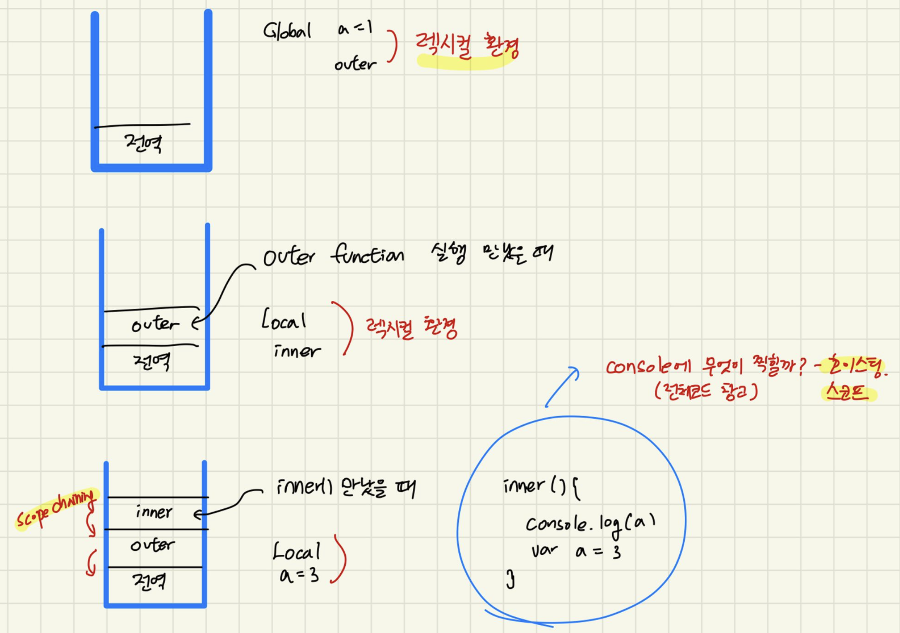

# 실행컨텍스트

**실행할 코드에 제공할 환경 정보를 모아놓은 객체**

코드를 실행할 때 필요한 환경정보들을 모아 콜스택에 쌓는다.  
-> 동일한 환경으로 구성된 실행컨텍스트는 콜스택에 쌓인다.

> 하나의 실행컨텍스트를 구성할 수 있는 방법
>
> - 전역공간
> - eval()함수
> - 함수

**흔히 우리가 실행컨텍스트를 구성하는 방법은 함수를 실행하는 것이다.**

**vscode에서의 테스트**  



inner()안에 있는 console.log(a)는 외부의 전역환경인
a를 바라볼 수 있는데 왜 undefined 일까?

> 코드가 실행되기 전임에도 불구하고 자바스크립트 엔진은 이미 환경에 속한 코드의 변수명들을 모두 알고있다. (호이스팅)  
> 5번이 실행되기 전에 inner()의 실행환경에는 a가 호이스팅되어 할당되지 않은채로 존재하기 때문이다.  
> 동일한 식별자를 선언한 경우, 무조건 스코프 체인 상에서 가장 먼저 발견된 식별자에만 접근이 가능하기 때문에 값이 할당되어있지 않다. (가장 가까운 곳부터 그 변수의 값을 가져온다.)  
> 실행환경이 종료되었을때는 스택의 성질처럼 위에부터 먼저 종료가 된다.

---

## 호이스팅

코드가 실행되기 전 자바스크립트의 엔진은 해당 환경에 속한 코드의 변수명을 미리 알고 있다.  
(실제로 최상단으로 올려지는건 아니지만, 그렇게 편의를위해 이해)

규칙

- 매개변수의 이름
- 함수 선언
- 변수명

**주의사항**  
함수선언부는 안에 내용까지 전체 호이스팅된다.  
함수표현식은 변수만 호이스팅된다.

```js
console.log(sum(1, 2));
console.log(multyply(3, 4));
function sum(a, b) {
  return a + b;
}

var multyply = function (a, b) {
  return a * b;
};
```

호이스팅된 과정으로 보면 아래와같이 볼 수 있습니다.

```js
function sum(a, b) {
  return a + b;
}
var multiply;
console.log(sum(1, 2));
console.log(multyply(3, 4)); // error 발생

multyply = function (a, b) {
  return a * b;
};
```

이처럼 함수표현식은 변수선언부만 호이스팅 된다.

<br/>
<br/>

<또다른 예시>

```js
var a = 1;
function a() {
  console.log(b);
  var b = "bbb";
  console.log(b);
  function b() {}
}
a();
```

어떤 결과가 나올까요 ?

이를 호이스팅되어 변경해보면 이렇습니다.

```js
var a;
var a = function a() {
  console.log(b);
  var b = "bbb";
  console.log(b);
  function b() {}
};

a = 1;
a();
```

이렇게 되어 a(); 여기서 a는 함수가 아니기 때문에 오류가 발생한다.

그렇다면 어떤것을 사용해야할까 ?
함수 선언문은 호이스팅 될 때 나중의 코드로 덮어씌우기 때문에 중복된 함수가 코드내에 있었을 경우 에러가 날 확률이 높다.
따라서, 표현식을 쓰는것이 안전하다.

<br/>

---

<br/>
<br/>

### 스코프, 스코프 체인

**스코프** : 식별자에대한 유효범위  
전역공간을 제외하면 오직 함수에 의해서만 스코프가 생성된다.  
**스코프체인** : 식별자의 유효범위 가까운 곳부터 먼 곳까지 차례로 검색해 나간다.

스코프체인은 렉시컬환경을 참조한다.
함수가 콜스택에 담긴 그 시점의 환경을 참조한다.
무조건 스코프 체인 상에서 가장 먼저 발견된 식별자에만 접근이 가능하다.

```js
var a = 1;
function outer() {
  function inner() {
    console.log(a);
    var a = 3;
  }
  inner();
  console.log(a);
}
outer();
console.log(a);
```


<br/>

맨위의 언급했던 예시이며
콜스택, 렉시컬환경, 호이스팅, 스코프, 스코프체인 모두 설명이 가능하다.

---

<br/>
<br/>

### 총정리

**실행컨텍스트**는 실행할 코드에 제공할 환경들을 모아놓은 객체이다.
실행컨텍스트 객체는 활성화 되는 시점에 Variable Environment, LexicalEnvironment, ThisBininding 세가지 정보를 수집한다.

실행컨텍스트를 생성할때 Variable Environment, LexicalEnvironment 두가지는 동일한 내용으로 구성되지만, LexicalEnvironment은 함수 실행도중에 정적으로 변경된다.

**LexicalEnvironment** 아래 두가지로 구성돼있다.

- environmentRecord : 매개변수명, 변수의 식별자, 선언한 함수의 함수명 등
- outerEnvironmentReference : 직전의 LexicalEnvironment 정보를 참조(scope chaining)

**스코프** 변수의 유효범위를 말한다.
렉시컬환경에서 연결된 외부환경을 참조해 그곳의 렉시컬환경에서 변수의 값을 탐색하는 과정을 거친다. 거쳐서 올라가다가 마지막에 전역컨텍스트에서도 찾지 못한다면 undefined를 반환한다. (scope chaining)

**this**
실행 컨텍스트를 활성화 하는 당시에 지정된 this가 저장된다.
함수를 호출하는 방법에 따라 그 방법이 달라지며, 지정되지 않은 경우에는 전역객체가 지정된다.
이것은 3장에서 자세히 다룬다.
