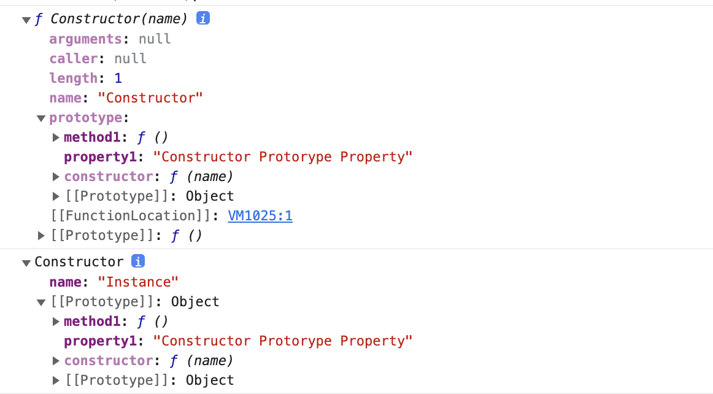
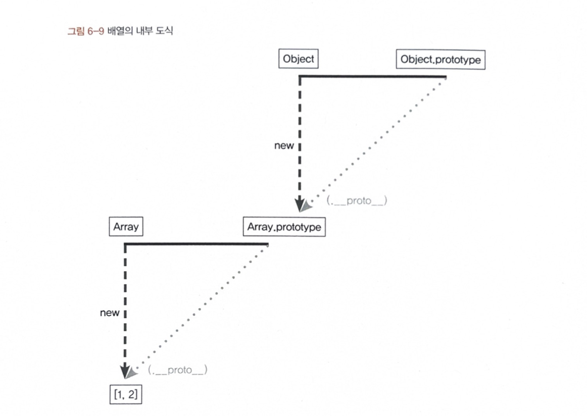

# 프로토타입

자바스크립트는 프로토타입 기반 언어입니다.
클래스 기반 언어에서는 상속을 사용하지만, 프로토타입 기반 언어에서는 어떤 객체의 원형(프로토타입)으로 삼고 이를 복제(참조)함으로써 상속과 비슷한 효과를 냅니다.

## 1. 프로토타입의 개념

### 6-1-1 constructor, prototype, instance

```javascript
var instance = new Constructor();
```

1. Constructor에 정의된 내용을 바탕으로 새로운 인스턴스가 생성됩니다.
2. instance에는 `__proto__` 라는 프로퍼티가 자동으로 부여됩니다.
3. `__proto__`는 Constuctor의 prototype이라는 프로퍼티를 참조합니다.

   prototype 객체 내부에는 인스턴스가 사용할 메서드를 저장하며, 인스턴스에서도 숨겨진 프로퍼티인 `__proto__`를 통하여 이 메서드에 접근할 수 있게 됩니다.

```javascript
var Person = function (name) {
  this.name = name;
};
Person.prototype.getName = function () {
  return this._name;
};
```

`__proto__`는 생략이 가능하다.

```javascript

//1
var suzi = new Person('Suzi);
suzi.__proto__.getName(); // undefined

//2
var hyejin = new Person('Hyejin);
hyejin.__proto__._name = 'Hyejin__proto__';
hyejin.__proto__.getName(); // Hyejin__proto__

//3
var daniel = new Person('Daniel');
daniel.getName(); // Daniel
// daniel.(__proto__.)getName)();과 동일

```

1번의 경우, 함수 실행은 정상적으로 되었으나, 바인딩된 객체가 `__proto__`임으로 여기에는 \_name이 존재하지 않기 때문에 undefined 가 출력된다.

2번의 경우 `__proto__`에 \_name을 지정하여 정상적으로 값이 출력된다.

3번의 경우 `__proto__`이 생략이 가능하는 속성을 이용하였다. `__proto__`를 빼면 this는 daniel instance가 된다.

> 생성자 함수의 prototype에 어떤 메서드나 프로퍼티가 있다면 인스턴스에서도 자신의 것처럼 해당 메서드나 프로퍼티에 접근할 수 있게 됩니다 .

```javascript
var Constructor = function (name) {
  this.name = name;
};
Constructor.prototype.method1 = function () {};
Constructor.protorype.property1 = "Constructor Protorype Property";

var instance = new Constructor("Instance");
console.dir(Constructor);
console.dir(instance);
```



prototype을 보면, 추가해준 `method1`, `property1`의 값은 진하게 보이고 ,`constructor`,`__proto__` 는 옅은 색을 보입니다.
이런 색상의 차기로 열거 가능한 프로퍼티임을 구분합니다. 짙은색은 열거가능한 프로퍼티 입니다.
(for in 등으로 객체의 프로퍼티 전체에 접근하고자할 때 접근 가능여부를 색상으로 구분지어 표기 )]

```javascript
for (let accessible in instance.__proto__) {
  console.log(accessible);
}
```

위의 경우 `constuctor과 `**proto**`과 같이 열거 불가능한 프로퍼티를 제외하고 열거가능한 프로퍼티인 `method1`,`property1`이 출력됩니다.

**배열 리터럴과 Array**

```javascript
var arr = [1, 2];

arr.forEach(function () {});
//arr은 Array의 인스턴스로 forEach 프로퍼티를 가용 가능.

Array.isArray(arr);
// Array에 prototype객체에는 isArray가 존재하여 가능 -> 결과 true

arr.isArray();
//arr은 Array의 instance로 사용 불가.
//isArray는 생성자 함수에서 직접 접근해야 실행가능
```

### 6-1-2 constructor 프로퍼티

생성자 함수의 프로퍼티인 prototype 객체 내부와 인스턴스의 **proto**객체 내부에도 마찬가지로 constructor 프로퍼티가 존재합니다.
이 프로퍼티는 자기 자신을 참조합니다.

> 인스턴스로부터 그 원형이 무엇인지를 알 수 있는 수단이기에 필요합니다.

```javascript
var arr = [1, 2];
console.log(arr.__proto__.constructor === Array); // true
console.log(arr.constructor === Array); // true
console.log(Array.prototype.constructor === Array); //true

var arr2 = new arr.constructor(3, 4);
console.log(arr2); // [3,4]
```

constructor는 읽기 전용 속성이 부여된 예외적인 경우( 기본형 리터럴 변수 - number, string, boolean)를 제외하고 값을 바꿀 수 있습니다.

하지만, constructor를 변경하더라도 참조하는 대상만 변경되 뿐, 이미 만들어진 어떤 인스턴스의 원형이 바뀌거나 데이터 타입이 변하지 않습니다. 즉, 어떤 인스턴스의 생성자 정보를 알아내기 위해서 constructor 프로퍼티에 의존하는게 항상 안전하지는 습니다.

---

## 프로토타입 체인

### 6-2-1 메서드 오버라이드

만약 인스턴스가 동일한 이름의 프로퍼티 또는 메서드를 가지고 있는 상황이라면 ?

```javascript
var Person = function (name) {
  this.name = name;
};
Person.prototype.getName = function () {
  return this.name;
};

var iu = new Person("지금");
iu.getName = function () {
  return "바로" + this.name;
};
console.log(iu.getName()); //바로지금
```

메서드 오버라이딩이 일어나 가장 가까운 대상인 자신의 프로퍼티를 검색하고 없으면 그 다음으로 가까운 대상인 `__proto__`를 검색하는 순서로 진행됩니다.

메서드 오버라이딩이 이미 된 상태에서 prototype에 있는 메서드에 접근하고 싶다면 ?

```javascript
//1
console.log(iu.__proto__.getName()); // undefined

//2
console.log(iu.__proto__.getName.call(iu)); // 지금

//3
Person.prototype.name = "이지금";
console.log(iu.__proto__.getName()); // 이지금
```

1번의 경우 `__proto__`에 있는 this에 name이 존재하지 않습니다.  
2번의 경우 call 메서드를 통해서 iu를 바인딩합니다.  
3번의 경우 prototype의 name에 값을 지정합니다.

결론으로 우회적으로 메서드 오버라이딩이 일어났더라도 우회적으로 접근은 가능합니다.

### 6-2-2 프로토타입 체인

프로퍼티가 연쇄적으로 이어진 것을 프로토타입 체인이라고 하고, 이 체인을 따라가며 검색하는 것을 프로토타입 체이닝이라고 합니다.

1.  어떤 메서드를 호출하면, 자바스크립트 엔진은 데이터 자신의 프로퍼티를 검색한다.
2.  원하는 메서드가 있으면 그 메서드를 실행한다.
3.  없으면 `__proto__`를 검색해서 있으면 그 메서드를 실행, 없으면 다시 `__proto__`를 검색해서 실행한다.


